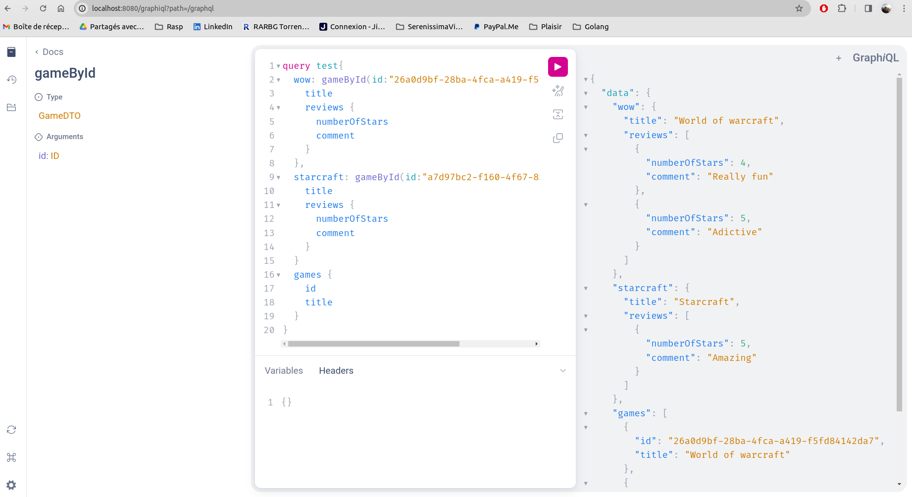

# A spring boot application using GraphQL

## Run the application
```
docker-compose up --build
```

## REST
You can either curl or use postman on http://localhost:8080

### List Studios


### Get a Studio


### Create a Studio


### List Games


### Get a Game


### Create a Game


## Graphiql 
To play with the graphql engine, open http://localhost:8080/graphiql?path=/graphql in your browser.

### Examples:


ps: ids of resources change on every restart.